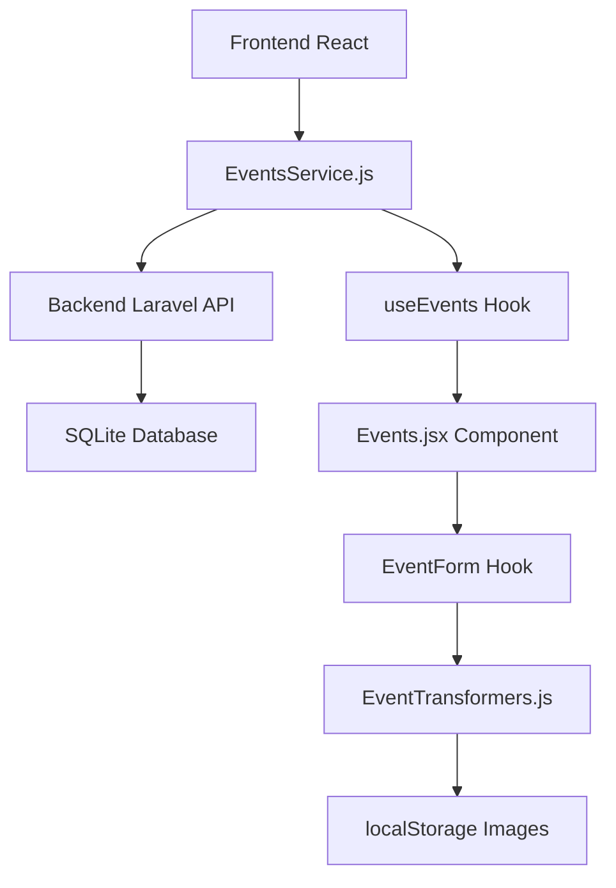
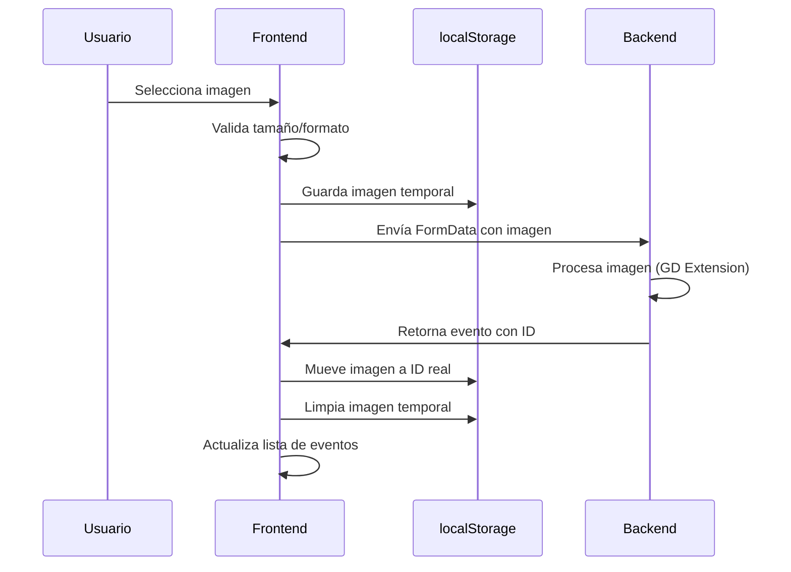

# 📋 Integración Detallada: Events y Notices-Categories desde Backend

## 🎯 **Resumen Ejecutivo**
Documentación completa y detallada sobre cómo se integran los eventos (events) y categorías de avisos (notices-categories) desde el backend en el frontend BVI, incluyendo manejo de imágenes en localStorage, tokens de autenticación, tabs, y preparación de datos para envío al backend.

---

## 📡 **1. INTEGRACIÓN DE EVENTS DESDE BACKEND**

### **1.1 Arquitectura de Comunicación**



### **1.2 Servicio de API (EventsService.js)**

#### **Configuración Base:**
```javascript
class EventsService {
  constructor() {
    this.baseURL = import.meta.env.VITE_API_BASE_URL || '/api'
    this.tokenKey = 'token'
  }
}
```

#### **Endpoints Implementados:**

| Método | Endpoint | Descripción | Autenticación |
|--------|----------|-------------|---------------|
| `GET` | `/api/events?pagination=6&page=1` | Listar eventos paginados | Bearer Token |
| `GET` | `/api/events/{id}` | Obtener evento específico | Bearer Token |
| `POST` | `/api/events` | Crear nuevo evento | Bearer Token + Admin |
| `POST` | `/api/events/{id}` | Actualizar evento | Bearer Token + Admin |
| `DELETE` | `/api/events/{id}` | Eliminar evento | Bearer Token + Admin |

#### **Headers de Autenticación:**
```javascript
getHeaders(includeContentType = false) {
  const token = this.getToken()
  const headers = {
    'Accept': 'application/json'
  }
  
  if (token) {
    headers['Authorization'] = `Bearer ${token}`
  }
  
  if (includeContentType) {
    headers['Content-Type'] = 'application/json'
  }
  
  return headers
}
```

### **1.3 Manejo de Tokens**

#### **Obtención del Token:**
```javascript
getToken() {
  return localStorage.getItem(this.tokenKey)
}
```

#### **Manejo de Sesión Expirada:**
```javascript
if (data.http_status === 401) {
  localStorage.removeItem(this.tokenKey)
  localStorage.removeItem('user')
  throw new Error('Sesión expirada. Por favor inicia sesión nuevamente.')
}
```

### **1.4 Estructura de Datos de Events**

#### **Datos Enviados al Backend (FormData):**
```javascript
{
  id: "123456789",                    // ID único generado
  title: "Taller de React",           // Título del evento
  category: "workshop",               // Tipo de evento
  date: "2025-10-25",                 // Fecha en YYYY-MM-DD
  start_time: "14:30",               // Hora de inicio HH:MM
  end_time: "16:00",                 // Hora de fin HH:MM
  repeat: "na",                      // Frecuencia de repetición
  content: "<h2>Contenido...</h2>",   // Descripción HTML
  short_description: "Taller...",     // Descripción corta
  location: "Sala A",                // Ubicación
  register_link: "https://...",       // Link de registro
  status: "1",                       // Estado (1=activo, 0=inactivo)
  thumbnail: File object             // Imagen del evento
}
```

#### **Datos Recibidos del Backend:**
```javascript
{
  id: "123456789",
  title: "Taller de React",
  category: "workshop",
  date: "2025-10-25",
  start_time: "14:30",
  end_time: "16:00",
  repeat: "na",
  content: "<h2>Contenido...</h2>",
  short_description: "Taller...",
  location: "Sala A",
  register_link: "https://...",
  status: 1,
  thumbnail: "processed-image-uuid.webp",
  original_thumbnail: "original-image-uuid.webp",
  blurred_thumbnail: "blurred-image-uuid.webp",
  created_at: "2025-10-22T18:45:58.000000Z",
  updated_at: "2025-10-22T18:45:58.000000Z"
}
```

---

## 🖼️ **2. MANEJO DE IMÁGENES EN LOCALSTORAGE**

### **2.1 Estrategia de Almacenamiento**

#### **Estructura en localStorage:**
```javascript
// Clave principal: 'eventsImages'
{
  "eventId_123": {
    "original": "data:image/jpeg;base64,/9j/4AAQSkZJRgABAQAAAQ...",
    "blurred": "data:image/jpeg;base64,/9j/4AAQSkZJRgABAQAAAQ..."
  },
  "eventId_456": {
    "original": "data:image/png;base64,iVBORw0KGgoAAAANSUhEUgAA...",
    "blurred": "data:image/png;base64,iVBORw0KGgoAAAANSUhEUgAA..."
  }
}
```

### **2.2 Funciones de Gestión de Imágenes**

#### **Guardar Imagen en localStorage:**
```javascript
const saveImageToLocalStorage = (eventId, imageFile, imageType = 'original') => {
  return new Promise((resolve, reject) => {
    if (!imageFile || !eventId) {
      reject(new Error('Missing imageFile or eventId'))
      return
    }
    
    try {
      const reader = new FileReader()
      reader.onload = (e) => {
        const dataUrl = e.target.result
        const eventsImages = getEventsImagesFromStorage()
        
        // Inicializar objeto del evento si no existe
        if (!eventsImages[eventId]) {
          eventsImages[eventId] = {}
        }
        
        // Guardar la imagen
        eventsImages[eventId][imageType] = dataUrl
        
        // Guardar en localStorage
        saveEventsImagesToStorage(eventsImages)
        resolve(true)
      }
      reader.onerror = (error) => {
        console.error(`❌ Error saving ${imageType} image to localStorage:`, error)
        reject(error)
      }
      reader.readAsDataURL(imageFile)
    } catch (error) {
      console.error(`❌ Error saving ${imageType} image to localStorage:`, error)
      reject(error)
    }
  })
}
```

#### **Obtener Imagen de localStorage:**
```javascript
export const getImageFromLocalStorage = (eventId, imageType = 'original') => {
  if (!eventId) return null
  
  try {
    const eventsImages = getEventsImagesFromStorage()
    const eventImages = eventsImages[eventId]
    
    if (!eventImages) return null
    
    return eventImages[imageType] || null
  } catch (error) {
    console.error(`❌ Error getting ${imageType} image from localStorage:`, error)
    return null
  }
}
```

#### **Eliminar Imagen de localStorage:**
```javascript
export const removeImageFromLocalStorage = (eventId, imageType = 'original') => {
  if (!eventId) return false
  
  try {
    const eventsImages = getEventsImagesFromStorage()
    const eventImages = eventsImages[eventId]
    
    if (!eventImages) return true // Ya no existe
    
    if (imageType === 'all') {
      // Eliminar todo el evento
      delete eventsImages[eventId]
    } else {
      // Eliminar solo el tipo específico
      delete eventImages[imageType]
      
      // Si no quedan imágenes para este evento, eliminar el evento completo
      if (Object.keys(eventImages).length === 0) {
        delete eventsImages[eventId]
      }
    }
    
    saveEventsImagesToStorage(eventsImages)
    return true
  } catch (error) {
    console.error(`❌ Error removing ${imageType} image from localStorage:`, error)
    return false
  }
}
```

### **2.3 Flujo de Imágenes en Creación de Eventos**



### **2.4 Preparación de Imágenes para Backend**

#### **En Creación de Eventos:**
```javascript
const createEvent = useCallback(async (eventData) => {
  setLoading(true)
  setError(null)

  try {
    // TODO PRODUCTION: CHANGE IMAGES - Save image to localStorage before sending to backend
    // Generate temporary ID for localStorage storage
    const tempId = `temp_${Date.now()}_${Math.floor(Math.random() * 1000)}`
    if (eventData.file) {
      await saveEventImageToLocalStorage(tempId, eventData.file)
    }
    
    const backendData = transformToBackend(eventData, false)
    const response = await eventsService.createEvent(backendData)
    
    if (response.http_status === 200) {
      const backendEvent = response.data
      
      // TODO PRODUCTION: CHANGE IMAGES - Move image from temp ID to real backend ID FIRST
      if (eventData.file && backendEvent.id) {
        // Get image from temp storage
        const tempImage = getImageFromLocalStorage(tempId, 'original')
        const tempBlurred = getImageFromLocalStorage(tempId, 'blurred')
        
        if (tempImage) {
          // Save with real backend ID - WAIT for it to complete
          await saveEventImageToLocalStorage(backendEvent.id, eventData.file)
          // Clean up temp storage
          removeImageFromLocalStorage(tempId, 'all')
        }
      }
      
      // NOW apply localStorage image logic to the new event (after moving the image)
      const eventWithImages = transformFromBackend(backendEvent)
      setEvents(prev => sortEventsByDate([...prev, eventWithImages]))
      clearEventsCache()
    }
  } catch (err) {
    console.error('Error creating event:', err)
    setError(err.message)
  } finally {
    setLoading(false)
  }
}, [])
```

#### **En Actualización de Eventos:**
```javascript
const updateEvent = useCallback(async (eventData) => {
  setLoading(true)
  setError(null)

  try {
    const existingEvent = events.find(e => e.id === eventData.id)
    const existingThumbnail = existingEvent?.imageFileName || existingEvent?.thumbnail || ''
    
    // TODO PRODUCTION: CHANGE IMAGES - Save image to localStorage before sending to backend
    // Handle image storage for updates
    if (eventData.file) {
      // Save new image to localStorage for the existing event ID
      await saveEventImageToLocalStorage(eventData.id, eventData.file)
    }
    
    const backendData = transformToBackend(eventData, true, existingThumbnail)
    const response = await eventsService.updateEvent(eventData.id, backendData)
    
    if (response.http_status === 200) {
      const updatedEvent = transformFromBackend(response.data)
      setEvents(prev => {
        const updatedEvents = prev.map(e => e.id === eventData.id ? updatedEvent : e)
        return sortEventsByDate(updatedEvents)
      })
      clearEventsCache()
    }
  } catch (err) {
    console.error('Error updating event:', err)
    setError(err.message)
  } finally {
    setLoading(false)
  }
}, [events])
```

#### **En Eliminación de Eventos:**
```javascript
const deleteEvent = useCallback(async (id) => {
  setLoading(true)
  setError(null)

  try {
    // TODO PRODUCTION: CHANGE IMAGES - Remove image from localStorage when deleting event
    console.log('🗑️ Removing event image from localStorage')
    removeEventImageFromLocalStorage(id)
    
    const response = await eventsService.deleteEvent(id)
    
    if (response.http_status === 200) {
      setEvents(prev => prev.filter(e => e.id !== id))
      clearEventsCache()
    }
  } catch (err) {
    console.error('Error deleting event:', err)
    setError(err.message)
  } finally {
    setLoading(false)
  }
}, [events, addNotification])
```

---

## 📊 **3. DISPLAY DE DATOS DE EVENTS**

### **3.1 Estructura de Visualización**

#### **Componente Principal (Events.jsx):**
```javascript
export const Events = () => {
  const { user, toggleRole, isInitialized } = useAuth()
  const { events, createEvent, updateEvent, deleteEvent, loading, error, pagination, refreshEvents, changePage } = useEvents()
  
  // Estados del modal
  const [isModalOpen, setIsModalOpen] = useState(false)
  const [modalMode, setModalMode] = useState('create')
  const [editingEventId, setEditingEventId] = useState(null)
  
  const eventForm = useEventForm()
  
  // ... lógica del componente
}
```

### **3.2 Renderizado de Lista de Eventos**

#### **Estructura de Tarjeta de Evento:**
```javascript
{events.map((event, index) => (
  <div key={event.id || `event-${index}`} className="event-card">
    <div className="event-image">
      {/* Imagen borrosa para carga rápida */}
       {
          e.target.style.display = 'none'
        }}
      />
      {/* Imagen principal de alta calidad */}
       {
          // Agregar clase loaded y ocultar imagen borrosa
          e.target.classList.add('loaded')
          const blurredImg = e.target.parentElement.querySelector('.event-image-blurred')
          if (blurredImg) {
            blurredImg.style.opacity = '0'
            setTimeout(() => {
              blurredImg.style.display = 'none'
            }, 300)
          }
        }}
        onError={(e) => {
          e.target.style.display = 'none'
        }}
      />
    </div>
    <div className="event-content">
      <div className="event-header">
        <span className={`event-type ${event.eventType.toLowerCase()}`}>
          {event.eventType}
        </span>
        <span className="event-date">{formatDate(event.date)}</span>
      </div>
      <div className="event-title one-line-ellipsis">
        <span className="event-title__inner" title={event.title}>{event.title}</span>
      </div>
      <p className="event-description">
        {useFallback ? truncateText(getEventDescriptionParagraphs(event)) : getEventDescriptionParagraphs(event)}
      </p>
      <div className="event-details">
        <div className="event-time">
          <span className="icon"><i className="bi bi-clock"></i></span>
          {formatTime(event.startTime)} - {formatTime(event.endTime)} {event.timeZone}
        </div>
        <div className="event-location">
          <span className="icon"><i className="bi bi-geo-alt"></i></span>
          {event.location}
        </div>
      </div>
      <div className="event-actions">
        {can(user, 'events:update') && (
          <button className="edit-btn" onClick={() => handleEdit(event.id)}>
            Edit Details
          </button>
        )}
        {can(user, 'events:delete') && (
          <button className="delete-btn" onClick={() => handleDelete(event.id)}>
            Delete
          </button>
        )}
        {!can(user, 'events:create') && (
          <button className="register-btn" onClick={() => openRegisterModal(event)}>
            Register Now
          </button>
        )}
      </div>
    </div>
  </div>
))}
```

### **3.3 Paginación de Eventos**

#### **Componente de Paginación:**
```javascript
<div className="events-pagination">
  <button 
    className="prev-btn"
    onClick={() => changePage(pagination.current_page - 1)}
    disabled={pagination.current_page <= 1}
  >
    <i className="bi bi-chevron-left"></i>
  </button>
  <div className="page-counter">
    <span>{pagination.current_page} of {pagination.last_page}</span>
    <small>({pagination.total} total events)</small>
  </div>
  <button 
    className="next-btn"
    onClick={() => changePage(pagination.current_page + 1)}
    disabled={pagination.current_page >= pagination.last_page}
  >
    <i className="bi bi-chevron-right"></i>
  </button>
</div>
```

### **3.4 Estados de Carga y Error**

#### **Skeleton Loading:**
```javascript
if (!isInitialized || loading) {
  return (
    <>
      {renderHeader()}
      <EventsListSkeleton count={6} />
      <EventsPaginationSkeleton />
    </>
  )
}
```

#### **Manejo de Errores:**
```javascript
if (error) {
  // Si el error es "No data found" (404), mostrar EmptyPage
  if (error.includes('No data found')) {
    return (
      <>
        {renderHeader()}
        <EmptyPage
          isAdmin={can(user, 'events:create')}
          title={can(user, 'events:create') ? 'Oops nothing to see here yet!' : 'Oops! No data found.'}
          description={
            can(user, 'events:create')
              ? <>Looks like you haven't added anything. Go ahead and add<br /> your first item to get started!</>
              : <>Nothing's been added here yet, or there might be a hiccup.<br />Try again or check back later!</>
          }
        />
      </>
    )
  }

  // Para otros errores, mostrar el estado de error normal
  return (
    <div className="events-error">
      <h2>Error loading events</h2>
      <p>{error}</p>
      {error.includes('Sesión expirada') ? (
        <div className="error-actions">
          <button onClick={() => window.location.href = '/login'} className="login-btn">
            Go to Login
          </button>
          <button onClick={refreshEvents} className="retry-btn">
            Try Again
          </button>
        </div>
      ) : (
        <button onClick={refreshEvents} className="retry-btn">
          Try Again
        </button>
      )}
    </div>
  )
}
```

---

## 🏷️ **4. INTEGRACIÓN DE NOTICES-CATEGORIES**

### **4.1 Servicio de API (NoticeCategoriesService.js)**

#### **Configuración Base:**
```javascript
class NoticeCategoriesService {
  constructor() {
    this.baseURL = import.meta.env.VITE_API_BASE_URL || 'http://localhost:8000/api'
    this.tokenKey = 'token'
  }
}
```

#### **Endpoints Implementados:**

| Método | Endpoint | Descripción | Autenticación |
|--------|----------|-------------|---------------|
| `GET` | `/api/notice-categories` | Listar categorías | Bearer Token |
| `GET` | `/api/notice-categories/{id}` | Obtener categoría específica | Bearer Token |
| `POST` | `/api/notice-categories` | Crear nueva categoría | Bearer Token + Admin |
| `POST` | `/api/notice-categories/{id}` | Actualizar categoría | Bearer Token + Admin |
| `DELETE` | `/api/notice-categories/{id}` | Eliminar categoría | Bearer Token + Admin |

### **4.2 Estructura de Datos de Notice Categories**

#### **Datos Enviados al Backend:**
```javascript
{
  title: "Categoría de Ejemplo",     // Título de la categoría
  status: 1                          // Estado (1=activo, 0=inactivo)
}
```

#### **Datos Recibidos del Backend:**
```javascript
{
  id: 1,
  title: "Categoría de Ejemplo",
  status: 1,
  created_at: "2025-10-22T18:45:58.000000Z",
  updated_at: "2025-10-22T18:45:58.000000Z"
}
```

### **4.3 Integración en Frontend (useNoticesState.js)**

#### **Carga de Categorías desde API:**
```javascript
const loadCategoriesFromAPI = useCallback(async () => {
  // Check if categories are already loaded and available
  if (categoriesLoaded) return

  setCategoriesLoading(true)
  try {
    const response = await noticeCategoriesService.getNoticeCategories() // Get all categories
    
    if (response.http_status === 200 && response.data) {
      // Transform API data to match local format
      const apiCategories = response.data.data.map(cat => ({
        id: cat.id,
        name: cat.title,
        slug: cat.title.toLowerCase().replace(/\s+/g, '-'),
        status: cat.status
      }))
      
      setCategories(apiCategories)
      setCategoriesLoaded(true)
      localStorage.setItem('bvi.notices.categoriesLoaded', 'true')
      localStorage.setItem('bvi.notices.categoriesCache', JSON.stringify(apiCategories))
      localStorage.setItem('bvi.notices.categoriesFromAPI', 'true')
      
      // Set first category as active if available
      if (apiCategories.length > 0 && !activeCategory) {
        setActiveCategory(apiCategories[0].id)
      }
    } else if (response.http_status === 404) {
      // No categories found - show empty state
      setCategories([])
      setCategoriesLoaded(true)
      localStorage.setItem('bvi.notices.categoriesLoaded', 'true')
      localStorage.setItem('bvi.notices.categoriesCache', JSON.stringify([]))
      localStorage.setItem('bvi.notices.categoriesFromAPI', 'true')
    }
  } catch (error) {
    console.error('Error loading categories from API:', error)
    // Don't fallback to localStorage - let empty state show
    setCategories([])
    setCategoriesLoaded(true)
    localStorage.setItem('bvi.notices.categoriesLoaded', 'true')
    localStorage.setItem('bvi.notices.categoriesCache', JSON.stringify([]))
    localStorage.removeItem('bvi.notices.categoriesFromAPI')
  } finally {
    setCategoriesLoading(false)
  }
}, [categoriesLoaded, categoriesLoading, activeCategory])
```

---

## 🗂️ **5. SISTEMA DE TABS**

### **5.1 Implementación de Tabs para Notices**

#### **Componente de Tabs (Notices.jsx):**
```javascript
// Mobile responsive effect
useEffect(() => {
  const mql = window.matchMedia(MOBILE_Q)
  const onChange = () => setIsMobile(mql.matches)
  mql.addEventListener?.('change', onChange)
  return () => mql.removeEventListener?.('change', onChange)
}, [])

// Load categories from API when component mounts
useEffect(() => {
  loadCategoriesFromAPI()
}, []) // Empty dependency array - only run once on mount

// Active tab management effect
useEffect(() => {
  if (!categories.length) {
    setActiveTabId(null)
    saveActiveTabId(null)
    return
  }
  if (!activeTabId || !categories.some(c => c.id === activeTabId)) {
    const next = categories[0].id
    setActiveTabId(next)
    saveActiveTabId(next)
  }
}, [categories, activeTabId])
```

### **5.2 Renderizado de Tabs**

#### **Versión Desktop:**
```javascript
{!isMobile ? (
  <div className="notices-desktop-header" role="region" aria-label="Notice categories">
    {categoriesLoading ? (
      <div className="category-tabs-skeleton">
        <div className="category-tab-skeleton"></div>
        <div className="category-tab-skeleton"></div>
        <div className="category-tab-skeleton"></div>
      </div>
    ) : (
      <>
        {categories.length > 0 ? (
          categories.map(category => (
            <div key={category.id} className="tab-group">
              <button
                className={`category-tab ${activeCategory === category.id ? 'active' : ''}`}
                onClick={() => setActiveCategory(category.id)}
              >
                <span>{category.name}</span>
              </button>
              {can(user, 'notices:update') && (
                <button
                  className="category-tab__edit"
                  onClick={(e) => { e.stopPropagation(); handleEditCategory(category.id); }}
                  aria-label="Edit category"
                >
                  <i className="bi bi-pencil-square"></i>
                </button>
              )}
              {can(user, 'notices:delete') && (
                <button
                  className="category-tab__delete"
                  onClick={(e) => { e.stopPropagation(); handleDeleteCategory(category.id); }}
                  aria-label="Delete category"
                >
                  <i className="bi bi-x-lg"></i>
                </button>
              )}
            </div>
          ))
        ) : (
          <div className="no-categories-message">
            <p>No notice categories created yet...</p>
          </div>
        )}
        {can(user, 'notices:create') && (
          <button
            className="add-category-btn"
            onClick={handleAddCategory}
            aria-label="Add new category"
          >
            <i className="bi bi-plus"></i>
            <span>Add Category</span>
          </button>
        )}
      </>
    )}
  </div>
) : (
  // Mobile version with dropdown picker
  <div className="notices-mobile-header" role="region" aria-label="Notice categories">
    {categoriesLoading ? (
      <div className="category-title-skeleton">
        <div className="category-picker-btn-skeleton">
          <span style={{ opacity: 0 }}>Loading...</span>
        </div>
      </div>
    ) : (
      <div className="category-title">
        {categories.length > 0 ? (
          <>
            <button
              type="button"
              className="category-picker-btn"
              onClick={() => setPickerOpen(true)}
              aria-haspopup="dialog"
              aria-controls="noticesTabPicker">
              <h2>
                {activeCategoryData?.name || 'Notices'}
              </h2>
              <i className="bi bi-chevron-down" aria-hidden="true"></i>
            </button>

            {/* Notices Tab Picker Dropdown */}
            <NoticesTabPicker
              open={pickerOpen}
              onClose={() => setPickerOpen(false)}
              categories={categories}
              activeTabId={activeTabId}
              onSelect={onSelectCategory}
              canManage={can(user, 'notices:create')}
              onAddCategory={onAddCategory}
              onDeleteCategory={onDeleteCategory}
              onEditCategory={handleEditCategory}
            />
          </>
        ) : (
          <div className="no-categories-message-mobile">
            <p>No notice categories created yet...</p>
          </div>
        )}
        {can(user, 'notices:create') && (
          <button
            className="add-category-btn-mobile"
            onClick={handleAddCategory}
            aria-label="Add new category"
          >
            <i className="bi bi-plus"></i>
          </button>
        )}
      </div>
    )}
  </div>
)}
```

### **5.3 Persistencia de Tabs**

#### **Guardar Tab Activo:**
```javascript
const saveActiveTabId = (tabId) => {
  try {
    if (tabId) {
      localStorage.setItem('bvi.notices.activeTabId', tabId.toString())
    } else {
      localStorage.removeItem('bvi.notices.activeTabId')
    }
  } catch (error) {
    console.warn('Could not save active tab ID:', error)
  }
}
```

#### **Cargar Tab Activo:**
```javascript
const loadActiveTabId = () => {
  try {
    return localStorage.getItem('bvi.notices.activeTabId')
  } catch (error) {
    console.warn('Could not load active tab ID:', error)
    return null
  }
}
```

---

## 🔄 **6. TRANSFORMACIÓN DE DATOS**

### **6.1 EventTransformers.js**

#### **Mapeo de Campos Frontend ↔ Backend:**
```javascript
const FIELD_MAPPINGS = {
  frontendToBackend: {
    id: 'id',
    title: 'title',
    eventType: 'category',
    date: 'date',
    startTime: 'start_time',
    endTime: 'end_time',
    repeat: 'repeat',
    description: 'content',
    location: 'location',
    register_link: 'register_link',
    status: 'status'
  },
  backendToFrontend: {
    id: 'id',
    title: 'title',
    category: 'eventType',
    date: 'date',
    start_time: 'startTime',
    end_time: 'endTime',
    repeat: 'repeat',
    content: 'description',
    short_description: 'shortDescription',
    location: 'location',
    register_link: 'register_link',
    status: 'status',
    thumbnail: 'imageFileName',
    created_at: 'created_at',
    updated_at: 'updated_at'
  }
}
```

#### **Mapeo de Valores:**
```javascript
const VALUE_MAPPINGS = {
  eventType: {
    frontendToBackend: {
      'conference': 'conference',
      'webinar': 'webinar',
      'workshop': 'workshop'
    },
    backendToFrontend: {
      'conference': 'Conference',
      'webinar': 'Webinar',
      'workshop': 'Workshop'
    }
  },
  repeat: {
    frontendToBackend: {
      'na': 'na',
      'daily': 'daily',
      'weekly': 'weekly',
      'monthly': 'monthly',
      'annually': 'annually',
      'custom': 'custom'
    },
    backendToFrontend: {
      'na': 'na',
      'daily': 'daily',
      'weekly': 'weekly',
      'monthly': 'monthly',
      'annually': 'annually',
      'custom': 'custom'
    }
  }
}
```

### **6.2 Transformación Frontend → Backend**

#### **Función transformToBackend:**
```javascript
export const transformToBackend = (frontendEvent, isUpdate = false, existingThumbnail = null) => {
  const baseData = transformObject(
    frontendEvent,
    FIELD_MAPPINGS.frontendToBackend,
    VALUE_MAPPINGS
  )

  // Remove short_description as it doesn't exist in backend
  delete baseData.short_description

  // Handle thumbnail
  if (isUpdate) {
    if (frontendEvent.file) {
      baseData.thumbnail = frontendEvent.file
    }
  } else {
    baseData.thumbnail = frontendEvent.file
  }

  // Convert status to string as expected by backend
  if (baseData.status !== undefined) {
    baseData.status = baseData.status.toString()
  }

  // Create JSON object with HTML and text content before removing editorHtml
  if (frontendEvent.editorHtml) {
    const descriptionObject = {
      descriptionHtml: frontendEvent.editorHtml,
      descriptionText: extractFirstParagraph(frontendEvent.editorHtml)
    }
    baseData.content = JSON.stringify(descriptionObject)
  }

  // Remove fields that might cause issues
  delete baseData.timeZone
  delete baseData.editorHtml
  delete baseData.imageFileName
  delete baseData.imagePreviewUrl
  delete baseData.recurrence

  // For new events (create mode), don't send ID - let backend generate it
  if (!isUpdate) {
    delete baseData.id
  }

  return baseData
}
```

### **6.3 Transformación Backend → Frontend**

#### **Función transformFromBackend:**
```javascript
export const transformFromBackend = (backendEvent) => {
  const frontendEvent = transformObject(
    backendEvent,
    FIELD_MAPPINGS.backendToFrontend,
    VALUE_MAPPINGS
  )

  // TODO PRODUCTION: CHANGE IMAGES - Use server URLs instead of localStorage
  // Handle new image structure with blurred and original thumbnails
  // PRIORITY: localStorage first, then server URLs
  const eventId = backendEvent.id
  
  // Try to get images from localStorage first (PRIORITY)
  const localStorageOriginal = getImageFromLocalStorage(eventId, 'original')
  const localStorageBlurred = getImageFromLocalStorage(eventId, 'blurred')
  
  // Always prioritize localStorage over server URLs
  if (localStorageOriginal) {
    frontendEvent.original_thumbnail = localStorageOriginal
    frontendEvent.imagePreviewUrl = localStorageOriginal
  } else {
    // Fallback to server URLs only if localStorage doesn't have the image
    frontendEvent.original_thumbnail = cleanImageUrl(buildImageUrl(backendEvent.original_thumbnail || backendEvent.thumbnail))
    frontendEvent.imagePreviewUrl = cleanImageUrl(buildImageUrl(backendEvent.thumbnail))
  }
  
  if (localStorageBlurred) {
    frontendEvent.blurred_thumbnail = localStorageBlurred
  } else {
    // Fallback to server URLs
    frontendEvent.blurred_thumbnail = cleanImageUrl(buildBlurredImageUrl(backendEvent.blurred_thumbnail))
  }
  
  // Parse JSON content if it exists, otherwise use legacy fields
  if (backendEvent.content) {
    try {
      const parsedContent = JSON.parse(backendEvent.content)
      if (parsedContent.descriptionHtml && parsedContent.descriptionText) {
        frontendEvent.editorHtml = parsedContent.descriptionHtml
        frontendEvent.description = parsedContent.descriptionText
      } else {
        // Fallback to plain content
        frontendEvent.description = backendEvent.content
        frontendEvent.editorHtml = ''
      }
    } catch (error) {
      // If JSON parsing fails, treat as plain text
      frontendEvent.description = backendEvent.content
      frontendEvent.editorHtml = ''
    }
  } else {
    // Legacy fallback
    frontendEvent.editorHtml = backendEvent.editorHtml || ''
    frontendEvent.description = backendEvent.content || ''
  }
  
  frontendEvent.timeZone = backendEvent.timeZone || 'UTC'
  frontendEvent.recurrence = backendEvent.recurrence || null

  return frontendEvent
}
```

---

## 🔐 **7. MANEJO DE TOKENS Y AUTENTICACIÓN**

### **7.1 Estructura de Tokens**

#### **Almacenamiento:**
```javascript
// En localStorage
localStorage.setItem('token', 'eyJ0eXAiOiJKV1QiLCJhbGciOiJSUzI1NiJ9...')
localStorage.setItem('user', JSON.stringify({
  id: 1,
  name: 'Admin User',
  email: 'admin@example.com',
  role: 'admin'
}))
```

#### **Obtención del Token:**
```javascript
getToken() {
  return localStorage.getItem(this.tokenKey)
}
```

### **7.2 Headers de Autenticación**

#### **Configuración de Headers:**
```javascript
getHeaders(includeContentType = false) {
  const token = this.getToken()
  const headers = {
    'Accept': 'application/json'
  }
  
  if (token) {
    headers['Authorization'] = `Bearer ${token}`
  }
  
  if (includeContentType) {
    headers['Content-Type'] = 'application/json'
  }
  
  return headers
}
```

### **7.3 Manejo de Sesión Expirada**

#### **Detección de 401:**
```javascript
async handleResponse(response) {
  if (!response.ok) {
    try {
      const data = await response.json()
      
      if (data.http_status === 401) {
        localStorage.removeItem(this.tokenKey)
        localStorage.removeItem('user')
        throw new Error('Sesión expirada. Por favor inicia sesión nuevamente.')
      } else if (data.http_status === 403) {
        throw new Error('Acceso denegado. Se requiere rol de administrador.')
      } else if (data.http_status === 400) {
        const errorMessage = data.message || 'Error de validación'
        const validationErrors = data.errors ? Object.values(data.errors).flat().join(', ') : ''
        throw new Error(`${errorMessage}${validationErrors ? ': ' + validationErrors : ''}`)
      } else if (data.http_status === 422) {
        const errorMessage = data.message || 'Errores de validación'
        const validationErrors = data.errors ? Object.values(data.errors).flat().join(', ') : ''
        throw new Error(`${errorMessage}${validationErrors ? ': ' + validationErrors : ''}`)
      } else if (data.http_status === 500) {
        const errorMessage = data.message || data.error || 'Error interno del servidor'
        throw new Error(`${errorMessage} (Error 500)`)
      } else {
        const errorMessage = data.message || data.error || `Error del servidor: ${response.status}`
        throw new Error(errorMessage)
      }
    } catch (parseError) {
      if (response.status === 404) {
        throw new Error('No data found')
      }
      throw new Error(`Error del servidor: ${response.status} ${response.statusText}`)
    }
  }
  
  try {
    return await response.json()
  } catch (parseError) {
    throw new Error('Error al procesar la respuesta del servidor')
  }
}
```

---

## 📋 **8. VALIDACIONES FRONTEND**

### **8.1 Validaciones de Events**

#### **Campos Requeridos:**
```javascript
const REQUIRED = [
  { key: 'title', label: 'Event Title', test: () => (eventForm?.form?.title || '').trim().length > 0 },
  { key: 'date', label: 'Date', test: () => !!eventForm?.form?.date },
  {
    key: 'description', label: 'Description', test: () => {
      const htmlValue = eventForm?.editorHtml || eventForm?.form?.description || '';
      const html = typeof htmlValue === 'string' ? htmlValue : (htmlValue?.html || '');
      const text = html.replace(/<[^>]+>/g, '').trim();
      return text.length > 0;
    }
  },
  { key: 'register_link', label: 'Registration Link', test: () => (eventForm?.form?.register_link || '').trim().length > 0 },
  { key: 'file', label: 'File Upload', test: () => !!(eventForm?.form?.imagePreviewUrl || eventForm?.form?.imageFileName) }
];
```

#### **Validaciones Detalladas:**
```javascript
const validate = (isEditMode = false) => {
  const errors = []
  
  // 📝 Campos de Texto (Mínimo 3 caracteres)
  if (!form.title.trim()) {
    errors.push('Title is required.')
  } else if (form.title.trim().length < 3) {
    errors.push('Title must be at least 3 characters long.')
  }
  
  // Content/Description validation
  const contentText = editorText.trim()
  if (!contentText) {
    errors.push('Description is required.')
  } else if (contentText.length < 3) {
    errors.push('Description must be at least 3 characters long.')
  }
  
  if (!form.location.trim()) {
    errors.push('Location is required.')
  } else if (form.location.trim().length < 3) {
    errors.push('Location must be at least 3 characters long.')
  }
  
  if (!form.register_link.trim()) {
    errors.push('Registration link is required.')
  } else if (form.register_link.trim().length < 3) {
    errors.push('Registration link must be at least 3 characters long.')
  }
  
  // 📅 Campos de Fecha y Hora
  if (!form.date) {
    errors.push('Date is required.')
  } else {
    const selectedDate = new Date(form.date)
    const today = new Date()
    today.setHours(0, 0, 0, 0)
    if (selectedDate < today) {
      errors.push('Date must be today or later.')
    }
  }
  
  if (!form.startTime) {
    errors.push('Start time is required.')
  } else {
    const timeRegex = /^([01]?[0-9]|2[0-3]):([0-5][0-9])$/
    if (!timeRegex.test(form.startTime)) {
      errors.push('Start time must be in HH:MM format.')
    }
  }
  
  if (!form.endTime) {
    errors.push('End time is required.')
  } else {
    const timeRegex = /^([01]?[0-9]|2[0-3]):([0-5][0-9])$/
    if (!timeRegex.test(form.endTime)) {
      errors.push('End time must be in HH:MM format.')
    }
  }
  
  // Check start time is before end time
  if (form.startTime && form.endTime && form.startTime >= form.endTime) {
    errors.push('Start time must be earlier than end time.')
  }
  
  // 📂 Campos de Selección (Enum)
  if (!form.eventType) {
    errors.push('Event type is required.')
  } else if (!['workshop', 'webinar', 'conference'].includes(form.eventType)) {
    errors.push('Event type must be workshop, webinar, or conference.')
  }
  
  if (!form.repeat) {
    errors.push('Repeat option is required.')
  } else if (!['na', 'daily', 'weekly', 'monthly', 'annually', 'custom'].includes(form.repeat)) {
    errors.push('Repeat option must be na, daily, weekly, monthly, annually, or custom.')
  }
  
  // 🖼️ Archivo de Imagen
  if (!isEditMode && !form.file && !form.imagePreviewUrl) {
    errors.push('An image is required.')
  }
  
  // Check image size if file is present (max 5MB = 5120 KB)
  if (form.file && form.file.size > 5 * 1024 * 1024) {
    errors.push('Image size must not exceed 5MB.')
  }
  
  // Check image format if file is present
  if (form.file) {
    const allowedTypes = ['image/jpeg', 'image/jpg', 'image/png', 'image/gif', 'image/webp']
    if (!allowedTypes.includes(form.file.type)) {
      errors.push('Image must be JPG, PNG, GIF, or WebP format.')
    }
  }
  
  // Convert array to single error message
  const errorMsg = errors.length > 0 ? errors.join(' ') : ''
  setErrorMessage(errorMsg)
  return errorMsg === ''
}
```

### **8.2 Banner de Errores**

#### **Renderizado de Errores:**
```javascript
{(missingRequired.length > 0 || eventForm.errorMessage) && (
  <div
    className="app-form__error-banner"
    role="alert"
    aria-live="assertive"
    tabIndex={-1}
    ref={bannerRef}
  >
    {missingRequired.length > 0 && (
      <div>
        <strong>Please fill all required fields:</strong> {missingRequired.join(', ')}
      </div>
    )}
    {eventForm.errorMessage && (
      <div>
        <strong>Error:</strong> {eventForm.errorMessage}
      </div>
    )}
  </div>
)}
```

---

## 🎨 **9. COMPONENTES UI Y SKELETON LOADING**

### **9.1 Skeleton Components**

#### **EventsListSkeleton:**
```javascript
const EventsListSkeleton = ({ count = 6 }) => {
  return (
    <div className="events-list">
      {Array.from({ length: count }, (_, index) => (
        <div key={index} className="event-card skeleton">
          <div className="event-image skeleton-image"></div>
          <div className="event-content">
            <div className="event-header">
              <div className="skeleton-badge"></div>
              <div className="skeleton-date"></div>
            </div>
            <div className="skeleton-title"></div>
            <div className="skeleton-description"></div>
            <div className="event-details">
              <div className="skeleton-time"></div>
              <div className="skeleton-location"></div>
            </div>
            <div className="event-actions">
              <div className="skeleton-button"></div>
              <div className="skeleton-button"></div>
            </div>
          </div>
        </div>
      ))}
    </div>
  )
}
```

#### **EventsPaginationSkeleton:**
```javascript
const EventsPaginationSkeleton = () => {
  return (
    <div className="events-pagination skeleton">
      <div className="skeleton-button"></div>
      <div className="skeleton-counter"></div>
      <div className="skeleton-button"></div>
    </div>
  )
}
```

### **9.2 Estados de Carga**

#### **Loading State:**
```javascript
if (!isInitialized || loading) {
  return (
    <>
      {renderHeader()}
      <EventsListSkeleton count={6} />
      <EventsPaginationSkeleton />
    </>
  )
}
```

#### **Error State:**
```javascript
if (error) {
  return (
    <div className="events-error">
      <h2>Error loading events</h2>
      <p>{error}</p>
      {error.includes('Sesión expirada') ? (
        <div className="error-actions">
          <button onClick={() => window.location.href = '/login'} className="login-btn">
            Go to Login
          </button>
          <button onClick={refreshEvents} className="retry-btn">
            Try Again
          </button>
        </div>
      ) : (
        <button onClick={refreshEvents} className="retry-btn">
          Try Again
        </button>
      )}
    </div>
  )
}
```

#### **Empty State:**
```javascript
if (events.length === 0) {
  return (
    <EmptyPage
      isAdmin={can(user, 'events:create')}
      title={can(user, 'events:create') ? 'Oops nothing to see here yet!' : 'Oops! No data found.'}
      description={
        can(user, 'events:create')
          ? <>Looks like you haven't added anything. Go ahead and add<br /> your first item to get started!</>
          : <>Nothing's been added here yet, or there might be a hiccup.<br />Try again or check back later!</>
      }
    />
  )
}
```

---

## 🔧 **10. CONFIGURACIÓN Y VARIABLES DE ENTORNO**

### **10.1 Variables de Entorno**

#### **Configuración Base:**
```env
VITE_API_BASE_URL=http://localhost:8000/api
VITE_APP_NAME=BVI Frontend
```

#### **Uso en Servicios:**
```javascript
// En EventsService.js
this.baseURL = import.meta.env.VITE_API_BASE_URL || '/api'

// En NoticeCategoriesService.js
this.baseURL = import.meta.env.VITE_API_BASE_URL || 'http://localhost:8000/api'
```

### **10.2 Configuración de Vite**

#### **vite.config.js:**
```javascript
import { defineConfig } from 'vite'
import react from '@vitejs/plugin-react'

export default defineConfig({
  plugins: [react()],
  server: {
    port: 5173,
    proxy: {
      '/api': {
        target: 'http://localhost:8000',
        changeOrigin: true
      }
    }
  }
})
```

---

## 📊 **11. MÉTRICAS Y PERFORMANCE**

### **11.1 Optimizaciones Implementadas**

#### **Lazy Loading:**
```javascript
// Componentes cargados bajo demanda
const EventsPageSkeleton = lazy(() => import('../pages/EventsPageSkeleton'))
```

#### **Memoización:**
```javascript
// useCallback para funciones estables
const loadEvents = useCallback(async (page = 1, forceRefresh = false) => {
  // ... lógica de carga
}, [pagination.per_page])
```

#### **Estado Local:**
```javascript
// Minimiza re-renders innecesarios
const [events, setEvents] = useState([])
const [loading, setLoading] = useState(false)
const [error, setError] = useState(null)
```

### **11.2 Monitoreo de Errores**

#### **Console Logging:**
```javascript
console.error('Error loading events:', err)
console.warn('Cache disabled due to storage limitations')
console.log('🧹 Cleared all events data from localStorage')
```

#### **Try-Catch en Operaciones Async:**
```javascript
try {
  const response = await eventsService.getEvents()
  setEvents(response.data)
  setError(null)
} catch (err) {
  console.error('Error loading events:', err)
  setError(err.message)
}
```

---

## 🎯 **12. CONCLUSIONES Y MEJORES PRÁCTICAS**

### **12.1 Fortalezas del Sistema**

1. **Arquitectura Limpia**: Separación clara de responsabilidades entre servicios, hooks y componentes
2. **Reutilización**: Hooks centralizados y componentes modulares
3. **UX Excelente**: Skeleton loading, validaciones en tiempo real, manejo de errores user-friendly
4. **Manejo de Estados**: Loading, error, success states bien definidos
5. **Escalabilidad**: Fácil agregar nuevas funcionalidades
6. **Performance**: Optimizaciones de carga y renderizado
7. **Accesibilidad**: ARIA labels, roles, y navegación por teclado

### **12.2 Áreas de Mejora Futura**

1. **Testing**: Implementar tests unitarios e integración
2. **Caching**: Implementar cache más sofisticado de eventos
3. **Offline Support**: PWA capabilities
4. **Real-time Updates**: WebSocket para actualizaciones en vivo
5. **Analytics**: Tracking de interacciones de usuario
6. **Image Optimization**: Compresión automática de imágenes
7. **Internationalization**: Soporte multi-idioma

### **12.3 Lecciones Aprendidas**

1. **Validación Dual**: Frontend + Backend para mejor UX
2. **Transformación de Datos**: Crítico para integración API
3. **Manejo de Estados**: Loading, error, success states
4. **User Feedback**: Mensajes claros y accionables
5. **Performance**: Skeleton loading mejora percepción
6. **localStorage Strategy**: Temporal hasta implementar CDN
7. **Error Handling**: Robusto y user-friendly

---

## 📝 **13. NOTAS TÉCNICAS IMPORTANTES**

### **13.1 TODOs para Producción**

```javascript
// TODO PRODUCTION: CHANGE IMAGES - Remove localStorage strategy and use server URLs
// TODO PRODUCTION: CHANGE IMAGES - Use full URL in production
// TODO BACKEND: Implement registration
// TODO BACKEND: send normalized recurrence to API
```

### **13.2 Configuración Backend Requerida**

#### **PHP Extensions:**
- ✅ **GD Extension** - Para procesar imágenes
- ✅ **SQLite** - Base de datos
- ✅ **Laravel** - Framework

#### **Permisos:**
- ✅ **Carpeta public** - Permisos de escritura
- ✅ **Uploads** - Directorio para imágenes

### **13.3 Estructura de Archivos Críticos**

```
src/
├── services/
│   ├── eventsService.js              # API de eventos
│   └── noticeCategoriesService.js     # API de categorías
├── hooks/
│   ├── useEvents.js                  # Hook principal de eventos
│   ├── useEventForm.js               # Hook del formulario
│   └── useNoticesState.js            # Hook de notices
├── utils/
│   └── eventTransformers.js         # Transformación de datos
├── sections/
│   ├── events/Events.jsx             # Componente principal de eventos
│   └── notices/Notices.jsx           # Componente principal de notices
└── components/
    ├── events/                       # Componentes específicos de eventos
    └── modals/                       # Modales compartidos
```

---

*Este documento proporciona una documentación completa y detallada de la integración de eventos y notices-categories desde el backend en el frontend BVI, cubriendo todos los aspectos técnicos, arquitectónicos y de experiencia de usuario.*
